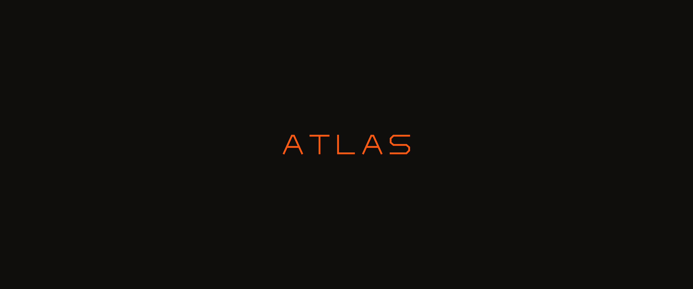

# ATLAS for Omarchy

**Carbon surfaces. Warm ivory text. Signal orange.**

A complete appearance bundle for Omarchy: boot menu, encrypted-disk unlock,
login, windows, shell, Matrix lock screen, terminal workspace, and applications.
ATLAS is the new name for the earlier Blackburn customization.



[Browse the palette and eight wallpapers](docs/preview.html).

**Version 1.0.0-rc4.** Tested against Omarchy **4.0.4-1**, Hyprland's Lua
configuration, and the Quickshell-based Omarchy shell. See
[compatibility](docs/COMPATIBILITY.md) and [release validation](docs/VALIDATION.md).

## Install

Clone the repository and run the one-command installer as your normal user:

```bash
git clone https://github.com/xrefor/omarchy-atlas-theme.git && cd omarchy-atlas-theme && ./install.sh
```

The script checks core dependencies, installs every user component, and activates
ATLAS. It does not install applications or change boot configuration. Preview
the same operation with `./install.sh --dry-run`. If you downloaded a release
archive, extract it and run `./install.sh` inside the extracted directory.

Open a new terminal and restart Zen after activation. Log out and back in to
propagate the font environment consistently. See the
[dependency list](docs/DEPENDENCIES.md) if the prerequisite check reports a
missing command. Optional application integrations, including Yazi, become active
when those applications are installed.

The extended shell uses the recipient's existing idle timeouts. Its Matrix
screensaver runs inside the secure lock surface, so it locks at the earlier of
screensaver and lock timeouts. See [authentication and shell](docs/AUTH.md).

### Boot menu, Plymouth, and SDDM

The boot component is included in the same archive and installed explicitly:

```bash
sudo python3 install.py boot --dry-run
sudo python3 install.py boot
# After rebooting and checking the boot/login screens:
sudo python3 install.py boot-confirm
```

It backs up the recipient's current EFI partition and changed system files,
adds the ATLAS assets, updates appearance settings, and rebuilds boot images
when required. It preserves disk identifiers, boot entries, kernel parameters,
timeouts, default entry, and authentication policies. A private transaction
backup is retained until `boot-confirm`. Interrupted transactions are handled
with `boot-recover`; see the recovery conditions in the boot guide. It never
copies a boot image from the creator's machine.

Select individual surfaces with `--limine`, `--plymouth`, or `--sddm`.
See [boot installation and recovery](docs/BOOT.md) for supported partition
layouts, enrollment handling, and rollback.

### Choose components

```bash
# Standard desktop colors, artwork and windows only:
python3 install.py --components theme

# Desktop fonts/toolkits/terminals and application workspace:
python3 install.py --components theme,desktop,apps

# Lock screen, Matrix rain, Polkit dialog and display widget:
python3 install.py --components shell

# Core network-command colors:
python3 install.py --components cli

# Optional CLI skins, selected explicitly:
python3 install.py --components cli --cli-groups cli-tcpdump,cli-metasploit,cli-shodan,cli-codex
```

`desktop` and `shell` also install the theme. Components share one installation
record, so later installation adds to the same backup baseline. The full archive
always contains every component regardless of the selected installation.

Omarchy's normal repository theme installer can load the root palette/artwork.
Omarchy restricts executable
theme files from downloaded repositories, so the complete experience uses the
local installer above.

## Included

| Surface | ATLAS treatment |
| --- | --- |
| Limine | ATLAS branding, carbon background, matching terminal colors |
| Plymouth | Original angular ATLAS wordmark, refined lock/password tile, progress line |
| SDDM | Matching logo, carbon login surface and warm password controls |
| Hyprland | Square windows, 1px focus borders, no shadows; desktop component adds 87% window opacity |
| Omarchy shell | Thin neutral outlines, orange focus, opaque panels; existing bar widgets and positions retained |
| Lock / authentication | Matrix rain, ATLAS tile and native Omarchy PAM/Polkit backend |
| Wallpapers | ATLAS Boot, ATLAS Vault, Ember Seam, Thermal Horizon, Cinder Array, Umbra Core, Ember Causeway, Obsidian Fold |
| Fonts / GTK | IBM Plex Mono and Sans, GTK3/GTK4 colors, Yaru orange icons |
| Terminals | Foot, Ghostty, Kitty and Alacritty preferences; palette generated by Omarchy |
| NymVPN panel | Live ATLAS tunnel dashboard, dVPN/Mixnet mode and settings menus; optional Nym installation |
| tmux / Starship | Persistent ATLAS header, tabs, full directory path and compact Git status |
| Yazi | Native colors, file markers, bounded image previews and removable-drive menu |
| Zen | Browser chrome and browser-owned internal pages; native profile discovery |
| Spotify terminal player | Selection, playback, lyrics, border and progress colors |
| btop / LazyGit / Lazydocker | Native palette and panel styling |
| Bash / eza / ls / fzf / jq | Coordinated listing, search and data colors |
| Network tools / Metasploit / Shodan | Optional presentation wrappers and native console prompt |
| Codex | Native ATLAS syntax theme asset; select through the client's theme controls |
| Other Omarchy apps | Standard Omarchy generation from the shared palette, including Neovim, Chromium, Obsidian and supported AI clients |

The proprietary graphical Spotify client, website content, and application
binaries are not modified. Wifite's visual adapter is included as reference
source, with its version and installation boundary documented; no machine-bound
root launcher is distributed. See [CLI coverage](docs/CLI.md).

## Everyday terminal shortcuts

| Shortcut | Action |
| --- | --- |
| Super+Shift+F | Yazi |
| Super+Shift+Alt+M | Spotify terminal player |
| Ctrl+Space, then F | Files tab |
| Ctrl+Space, then M | Monitoring pane on wide terminals, tab on narrow terminals |
| Ctrl+Space, then S | Music tab |
| Ctrl+Space, then N | NymVPN panel (requires Nym daemon and matching CLI) |
| Ctrl+Space, then I | Directory summary |
| Alt+1 / Alt+2 / … | Switch terminal tabs |
| Ctrl+B | Alternative tmux prefix |

Press the prefix, release it, then press the lowercase letter. In Yazi, **M** or
**g m** opens Drives. The drive menu uses UDisks/Polkit for mount and eject actions.

See [VPN panel controls and dependencies](docs/VPN.md).

## One palette

The palette lives in `~/.config/omarchy/themes/atlas/colors.toml` after installation.
Apply changes with `omarchy theme set atlas`. The application hook reads the
active resolved Omarchy palette, so it also follows other themes.

```bash
atlas-theme sync          # regenerate managed application colors
atlas-theme check         # report drift; exit nonzero if regeneration is needed
atlas-theme doctor --all  # check dependencies
```

Templates live in `components/apps/templates/` and `components/desktop/themed/`.
The installed runtime is self-contained in `~/.local/share/atlas/`; the extracted
archive can be removed after installation. Manual edits to managed files stop
updates/removal until reconciled, rather than being silently overwritten.

## Remove

Select a different Omarchy theme before restoring user files:

```bash
omarchy theme set "Tokyo Night"
atlas-theme restore --dry-run
atlas-theme restore
```

User originals and installed snapshots are recorded privately under
`~/.local/state/atlas-bundle/`. Original file modes and symlinks are restored;
files introduced by the bundle are removed. This directory is local state and
must never be included in a shared archive. An interrupted user installation
can be rolled back with `atlas-theme recover` or `python3 install.py recover`.

For boot removal, use the extracted bundle:

```bash
sudo python3 install.py boot-restore --dry-run
sudo python3 install.py boot-restore
```

Boot removal rebuilds the current installed kernel with the restored appearance.
It does not downgrade to the boot image saved during the original installation.

## Development and sharing

```bash
python3 tools/check.py
python3 tools/build.py
```

The build writes `dist/atlas-1.0.0-rc4.tar.gz` and a SHA-256 sidecar. The archive
contains a per-file hash manifest, source, artwork, component installers, tests,
licenses and documentation. It excludes caches, backups, account profiles,
application logs, screenshots of personal content and hardware configuration.

See [release validation](docs/VALIDATION.md), [credits](docs/CREDITS.md), and
[renaming/migration](docs/MIGRATION.md). MIT license applies to project source;
upstream notices are retained in `LICENSES/`.
