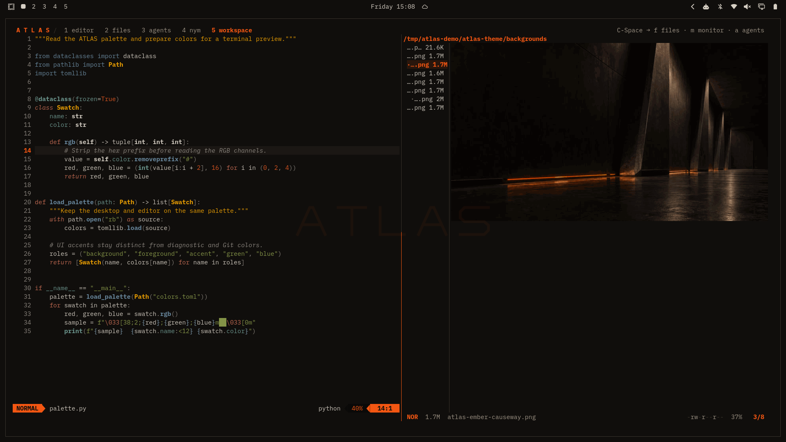
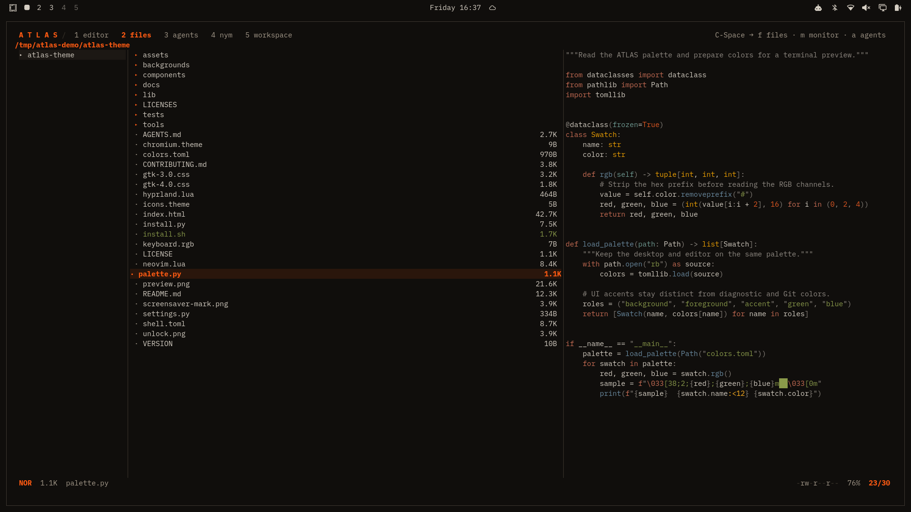
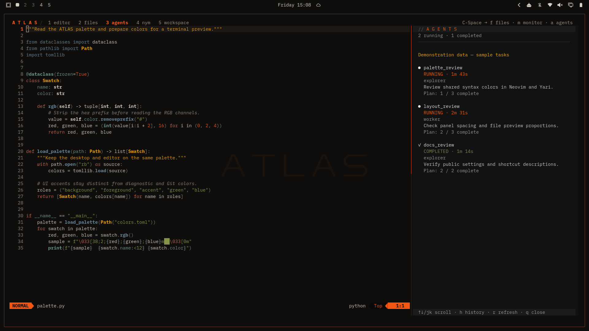
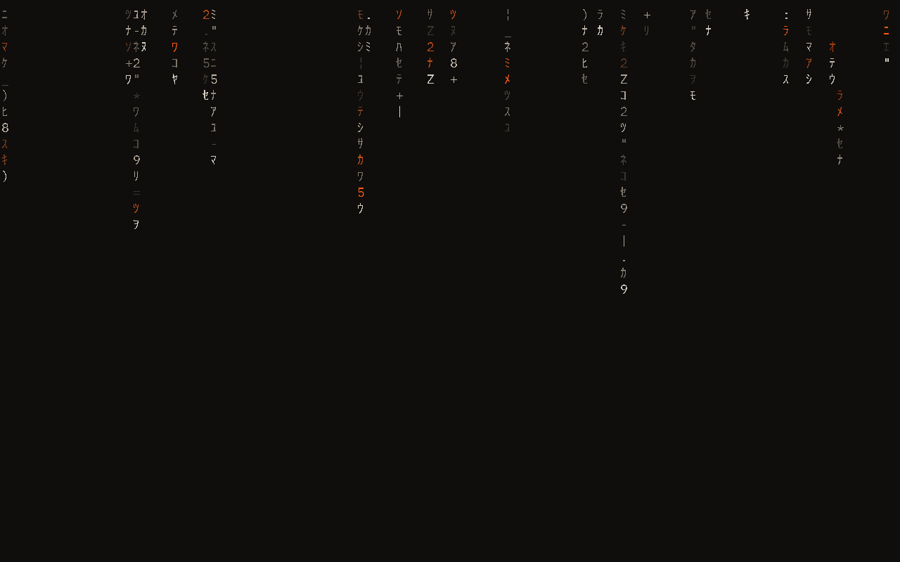
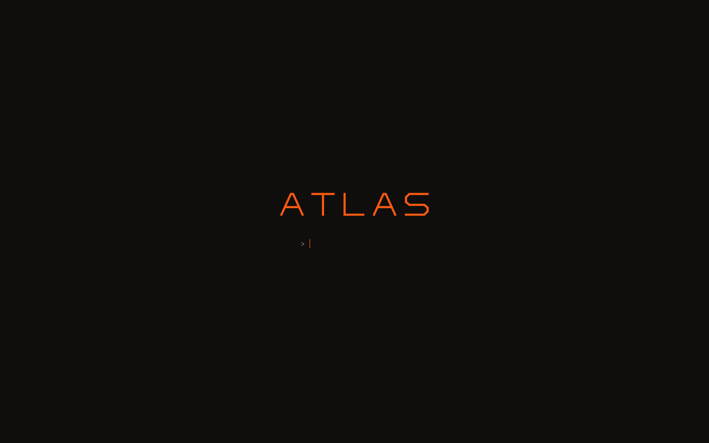
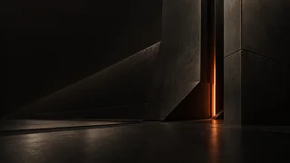

<p align="center">
  
</p>

# ATLAS for Omarchy

**Carbon. Ivory. Signal.**

ATLAS brings carbon surfaces, warm ivory text and signal orange to Omarchy.
Readable code colors, square windows and coordinated application styling carry
the palette through the desktop. Its terminal workspace adds tabs, visual file
browsing and compact panels for Git project context, local ports, Codex agents and NymVPN,
with matching lock screens and optional boot and login styling.

**[Explore ATLAS ↗](https://xrefor.github.io/atlas-showcase/)** · [Install](#install) · [Screenshots](#screenshots) · [Reference](#reference)

[](docs/media/atlas-desktop.png)

Thin borders, IBM Plex typography and orange where attention belongs. New
installations default to **100% window opacity**. Change it through
**Omarchy → ATLAS → Window opacity**, or run `atlas-settings`. Updates preserve
your existing opacity choice.

| Carbon | Surface | Outline | Ivory | Signal |
| --- | --- | --- | --- | --- |
| `#100E0C` | `#1C1814` | `#3A342C` | `#D6CFC4` | `#FF5A12` |

## Screenshots

### A workspace for everyday use

[](https://xrefor.github.io/atlas-showcase/#screenshots)

*20 seconds in real applications at the normal 9 pt terminal font size.
The agent and VPN panels show demonstration data.*
[Watch with playback controls](https://xrefor.github.io/atlas-showcase/#screenshots) · [Download the video](docs/media/atlas-overview.mp4)

| Neovim | Yazi |
| --- | --- |
| [](docs/media/atlas-editor.png) | [](docs/media/atlas-files.png) |
| Readable comments and hints; distinct colors for functions, strings, types and control flow. Completion icons follow those same roles. | Matching code-preview colors, quiet directory names and a clear focused row. Filenames get half the width; **T** expands the preview. |

The tmux workspace keeps files, Git Status, ports, agents, VPN and music within reach, with a
persistent header, tabs and a Starship prompt. Terminal preferences cover Foot,
Ghostty, Kitty and Alacritty; app styling also includes btop, LazyGit, Lazydocker,
Spotify Player, Discordo and Zen. [Coverage and dependencies](docs/DEPENDENCIES.md).

### Panels alongside your work

The **Git Status** panel (**Ctrl+Space → g**) shows uncommitted changes,
unpushed commits and upstream changes for the repository selected when it opens.
Press **f** to check its configured upstream and see when the remote was last
checked; normal refresh stays local. It never commits, pushes or merges your
work. See the [Git Status guide](docs/PANELS.md).

The **Ports & Services** panel (**Ctrl+Space → p**) shows local listening ports,
their processes and PIDs, and associated systemd units when available. Switch
between TCP and UDP or filter by port, address, account, process or service.
Collection is read-only. Opening requests live administrator details through
the desktop Polkit popup; cancelling keeps ordinary user details. Press **a**
to retry authorization or **r** to return to ordinary user updates.
Both views refresh every two seconds. See the [Ports & Services guide](docs/PORTS.md).

The panels use the active Omarchy palette. They open beside your work on wide
terminals and in a separate tmux window when space is limited. Their shortcuts
are included in the apps component; external-service panels remain dormant
until their own application is installed or configured.

| Codex agents | NymVPN |
| --- | --- |
| [](docs/media/atlas-agents.png) | [](docs/media/atlas-terminal.png) |
| Follow the current local Codex CLI conversation's child agents: tasks, status, elapsed time and reported plan progress. The read-only panel opens automatically without taking focus. **Ctrl+Space → a** toggles it. | See tunnel status, select dVPN or Mixnet mode, and adjust Nym settings. Requires a NymVPN account, daemon and matching CLI. **Ctrl+Space → n** toggles it. |

*Demonstration data: the panel captures use sample agent tasks and VPN status.*

Closing a panel leaves agents and the VPN running. The agent observer is a local,
version-sensitive integration; Nym setup and account management remain in Nym's
own tools. See [agent panel behavior](docs/AGENT-PANEL.md) and
[NymVPN setup and controls](docs/VPN.md).

### Two lock-screen styles

| Classic · default | Terminal |
| --- | --- |
| [](docs/media/atlas-lock.gif) | [](docs/media/atlas-lock-terminal.gif) |
| Matrix rain, blurred wallpaper and a framed password field. | A centered ATLAS mark and a blinking chevron, opening directly to password input. |

*Looping captures of the native lock-screen component.
Still images: [Classic](docs/media/atlas-lock.png) · [Terminal](docs/media/atlas-lock-terminal.png).*

Choose **ATLAS → Lock screen → Classic / Terminal**. Both appearances use the
same Omarchy session-lock service and native authentication backend. The shell
component retains your idle timeouts; Classic's Matrix screensaver runs inside
the lock surface, so it locks at the earlier of the screensaver and lock
timeouts. [Styles](docs/LOCK-SCREEN.md) · [Authentication behavior](docs/AUTH.md).

## Install

**Version 1.0.0-rc7.** Tested against Omarchy **4.0.4-1**, Hyprland's Lua
configuration and the Quickshell-based Omarchy shell.
[Compatibility](docs/COMPATIBILITY.md) · [Validation](docs/VALIDATION.md).

Clone the repository and run the installer as your normal user:

```bash
git clone https://github.com/xrefor/omarchy-atlas-theme.git && cd omarchy-atlas-theme && ./install.sh
```

The installer checks dependencies, installs every user component and activates
ATLAS. **Boot and login styling are installed separately.** Preview the operation
with `./install.sh --dry-run`. For a release archive, extract it and run
`./install.sh` inside the extracted directory.

In an interactive terminal, missing optional applications are offered
individually: Yazi, Spotify Player, Lazygit, Lazydocker, Zen and NymVPN. Every
choice defaults to **No**, and AUR packages are identified before confirmation.
If Nym is installed, a separate prompt offers its missing CLI matched to the
daemon version. Dry runs, staged installs and noninteractive runs skip these
prompts. Revisit them with `python3 lib/atlas/optional.py`.

Existing enabled clones of the lock, idle, Polkit or monitor plugins conflict
with ATLAS shell styling. The prerequisite check lists commands to disable
them while preserving their files. To retain those clones, install with
`python3 install.py --components theme,desktop,apps,cli`, then activate using
`omarchy theme set atlas`.

Open a new terminal and restart Zen after activation. Log out and back in to
propagate the font environment consistently. Optional app integrations become
active when their applications are installed. See [dependencies](docs/DEPENDENCIES.md)
if the prerequisite check reports a missing command.

<details>
<summary>Choose components</summary>

```bash
# Standard desktop colors, artwork and windows:
python3 install.py --components theme

# Add fonts, toolkits, terminals and the application workspace:
python3 install.py --components theme,desktop,apps

# Lock styles, Matrix rain, Polkit dialog and display widget:
python3 install.py --components shell

# Network-command colors:
python3 install.py --components cli
```

The `desktop` and `shell` components also install the theme. Later component
installs share the original backup baseline. Optional CLI skins are selected
explicitly; see [CLI coverage](docs/CLI.md).

Omarchy's normal repository theme installer loads the root palette and artwork.
The local installer above installs the complete workspace and shell additions.

</details>

<details>
<summary>Optional boot menu, Plymouth and SDDM styling</summary>

```bash
sudo python3 install.py boot --dry-run
sudo python3 install.py boot
# After rebooting and checking the boot and login screens:
sudo python3 install.py boot-confirm
```

The boot component adds ATLAS styling to Limine, Plymouth and SDDM, preserving
boot entries, disk identifiers, kernel parameters and authentication policies.
It backs up the EFI partition and changed system files, retaining its private
transaction backup until confirmation. Select surfaces with `--limine`,
`--plymouth` or `--sddm`. Read [boot installation and recovery](docs/BOOT.md) for
supported layouts, enrollment handling and interrupted transactions.

</details>

## Reference

Open **Omarchy → ATLAS**, or run `atlas-settings`, for wallpapers, opacity,
lock styles, Neovim comment brightness, shortcuts, diagnostics and restoration.
In tmux, **Ctrl+Space** then **f**, **g**, **p**, **a**, **n** or **s**
opens Files, Git Status, Ports & Services, Agents, NymVPN or music;
**Alt+1 / Alt+2 / …** switches tabs. In Yazi, **M** or **g m** opens Drives.

| Guide | What it covers |
| --- | --- |
| [Settings](docs/SETTINGS.md) | Appearance choices, editor behavior and managed configuration |
| [Dependencies](docs/DEPENDENCIES.md) | Required tools and optional application integrations |
| [Discordo](docs/DISCORDO.md) | Palette overlay and version-pinned ATLAS presentation patch |
| [Git Status panel](docs/PANELS.md) | Local Git data, shortcuts and collection boundaries |
| [Ports & Services panel](docs/PORTS.md) | Local listeners, process ownership, filtering and visibility limits |
| [Agent panel](docs/AGENT-PANEL.md) | Observation, controls and local Codex compatibility |
| [NymVPN panel](docs/VPN.md) | Dependencies, service setup and tunnel controls |
| [Lock screen](docs/LOCK-SCREEN.md) · [Authentication](docs/AUTH.md) | Classic and Terminal styles, idle and authentication behavior |
| [Boot](docs/BOOT.md) | Installation, recovery and removal of boot/login styling |
| [CLI coverage](docs/CLI.md) | Command colors and optional tool integrations |

<details>
<summary>Eight included wallpapers</summary>

<table>
<tr>
<td align="center"><a href="backgrounds/atlas-ember-seam.png"></a><br>Ember Seam</td>
<td align="center"><a href="backgrounds/atlas-boot.png"></a><br>ATLAS Boot</td>
<td align="center"><a href="backgrounds/atlas-vault.png"></a><br>ATLAS Vault</td>
<td align="center"><a href="backgrounds/atlas-thermal-horizon.png"></a><br>Thermal Horizon</td>
</tr>
<tr>
<td align="center"><a href="backgrounds/atlas-cinder-array.png"></a><br>Cinder Array</td>
<td align="center"><a href="backgrounds/atlas-umbra-core.png"></a><br>Umbra Core</td>
<td align="center"><a href="backgrounds/atlas-ember-causeway.png"></a><br>Ember Causeway</td>
<td align="center"><a href="backgrounds/atlas-obsidian-fold.png"></a><br>Obsidian Fold</td>
</tr>
</table>

[Browse the interactive collection](https://xrefor.github.io/atlas-showcase/#wallpapers).

</details>

<details>
<summary>Palette synchronization and restoration</summary>

The installed palette lives in `~/.config/omarchy/themes/atlas/colors.toml`.
Apply palette edits with `omarchy theme set atlas`. Application colors and the
terminal panels also follow other active Omarchy themes.

```bash
atlas-theme sync          # regenerate managed application colors
atlas-theme check         # report drift
atlas-theme doctor --all  # check dependencies
```

The installed runtime is self-contained in `~/.local/share/atlas/`. Configuration
changes use the installation journal; later manual edits require reconciliation
before updates or restoration overwrite them.

To remove ATLAS, select another theme, then preview and restore saved files:

```bash
omarchy theme set "Tokyo Night"
atlas-theme restore --dry-run
atlas-theme restore
```

Log out and back in to clear the session's retained font settings. Original files
and snapshots are stored privately under `~/.local/state/atlas-bundle/`.
Interrupted user installs can be rolled back with `atlas-theme recover`. Boot
removal is separate: see [boot restoration](docs/BOOT.md).

</details>

<details>
<summary>Development, validation and credits</summary>

See the [contributor guide](CONTRIBUTING.md), [validation commands and CI coverage](docs/VALIDATION.md),
[credits](docs/CREDITS.md) and [migration notes](docs/MIGRATION.md).
`python3 tools/check.py` runs the complete repository checks;
`python3 tools/check_release.py` verifies packaging and release behavior.

ATLAS was previously named Blackburn. Project source uses the MIT license except
for the clearly separated GPL-3.0 Discordo patch; upstream notices are retained
in `LICENSES/`.

</details>

---

**ATLAS / Carbon. Ivory. Signal.** · [Credits](docs/CREDITS.md) · [License](LICENSE) · [Explore ATLAS](https://xrefor.github.io/atlas-showcase/)
